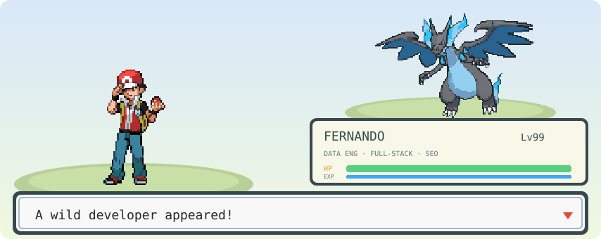
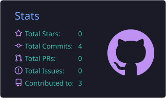
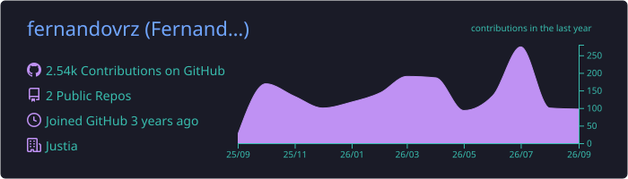

<!-- Animated battle header -->

  

  

  
  
  
  

---

##  About me

I'm **Fernando**, a data engineer and full-stack developer at **[Justia](https://www.justia.com)**, where code, data and SEO meet every day.

- 📊 **Data Engineering** — pipelines, scraping, tracking plans and analytics people actually use.
- 🧑‍💻 **Full-Stack** — web products built with Next.js, React and Python.
- 🔍 **Technical SEO** — I build tools that help sites rank better, and write about it at [seo-developers.com](https://seo-developers.com).
- 🤖 Exploring **applied AI and agents** to automate real work.
- ⌨️ Off the clock: I build **split mechanical keyboards** (Sofle + Cirque trackpad on ZMK).
- 📍 Guanajuato, Mexico · 🇲🇽 Spanish / 🇺🇸 English

<table align="center">
  <tr>
    <td align="center" width="230">
      
      
    </td>
    <td>
<pre>
TRAINER CARD

NAME       Fernando Vargas
ROLE       Data Engineer · Full-Stack Developer
TEAM       Justia
HOMETOWN   Guanajuato, Mexico
SPECIALTY  Data pipelines · Technical SEO · AI agents
PARTNER    Mega Charizard X
BADGES     Python · Next.js · SQL · SEO
</pre>
    </td>
  </tr>
</table>

---

##  My team

<table align="center">
  <tr>
    <td align="center" width="130"> <b>Mega Charizard X</b> Full-Stack</td>
    <td align="center" width="130"> <b>Metagross ✨</b> Analytics &amp; SQL</td>
    <td align="center" width="130"> <b>Blastoise</b> Data Pipelines</td>
  </tr>
  <tr>
    <td align="center" width="130"> <b>Dragonite</b> Technical SEO</td>
    <td align="center" width="130"> <b>Rayquaza</b> AI &amp; Agents</td>
    <td align="center" width="130"> <b>Tyranitar</b> Infra &amp; Docker</td>
  </tr>
</table>

  In the PC box:
  
  

---

##  Moveset

  

  
  
  
  
  

---

##  Trainer stats

  
  

  

  

---

##  Featured projects

- 🎓 **[anuies-scraper](https://github.com/fernandovrz/anuies-scraper)** — Python scraper for Mexico's ANUIES higher-education data.
<!-- More projects coming soon -->

---

##  Contributions

  <picture>
    <source media="(prefers-color-scheme: dark)" srcset="https://raw.githubusercontent.com/fernandovrz/fernandovrz/output/github-snake-dark.svg" />
    
  </picture>

  

